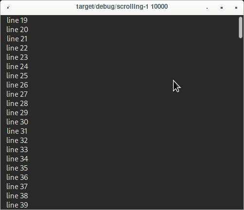

# Scrolling-1

A scrolling experiment.

This is based on [linebender/druid/issue #1990](https://github.com/linebender/druid/issues/1990) but
uses Label instead of TextBox and allows a command line parameter to specify `line_cnt`.

## Run
```
cargo run --bin scrolling-1 100
```

:
